### Oct 18 2022, Tuesday

1.

To recap the current situation: I've just gotten the SNC algorithm to work on caterpillar. I was able to train within a radius of 2 kpc (without filtering small clusters), and using a knn of 100 to construct the clustering graph. The accuracy achieved wasn't the greatest but was bearable. 

My current undertaking is to expand the radius to 5kpc and perform small cluster filtering of stars that are within the said radius. A dataset with those parameters have a cardinality between $10^4$ and $10^5$. That explodes the memory when knn=100. So, I cut knn down to 10, and it works fine. 

The training results, currently, seem pretty bleak. The egnn algorithm is not getting high std (expected) but also very low accuracy of classification. The two rows on the countmatrix are the actual labels (so, we can see that they are fairly even, which is surprising). The columns are the predicted labels. 

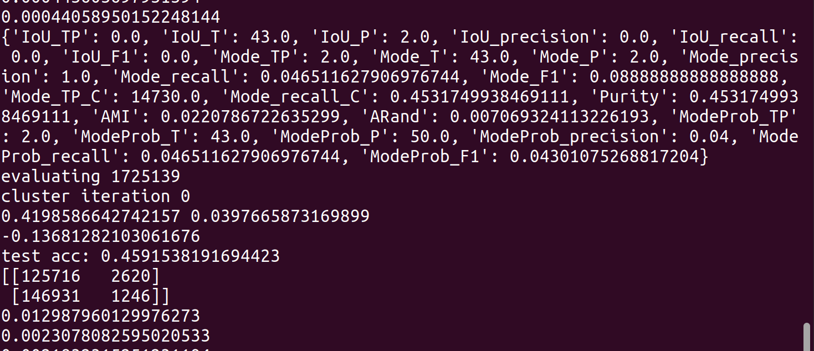

It seems to be generating only 1 cluster prediction, which is reasonable since most of the edges are predicted to be connected. Sometimes the first row has 3x as much--> too many connections which makes sense since we reduce knn from 100 to 10. 

The LR is effective, but it is not taking away a lot from each episode of training (we always start from a high loss). 

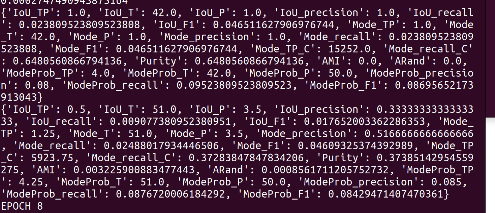

Matters hardly improve over time. 

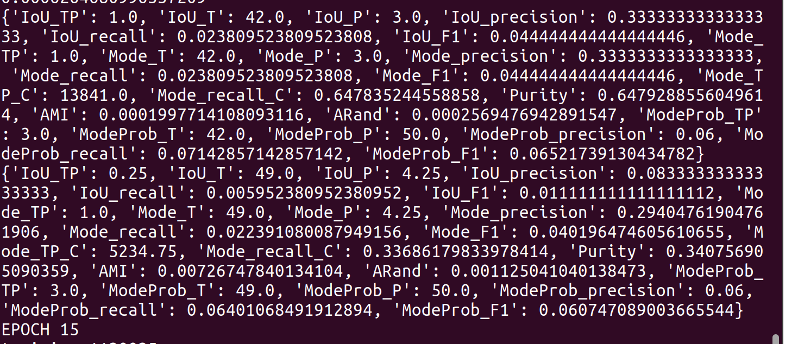

2.

I'm upping the knn to 30 and the egnn_regularizer term to 0.3 from 0.1 

It doesn't work.

3.

It looks like we will have to use sampling anyhow, the reason is that if we don't, we cannot account for the difference in density between datasets. So the learning done on caterpillar cannot be transferred to Gaia. So the idea may be to use sampling to obtain a bunch of clustering results, and then use those results to construct the final result for the dataset's clustering. 

So here is 10000 sampled, 100 knn result. It seems to do a better job with both clustering and the egnn step (as in, it's closer to 0.5)

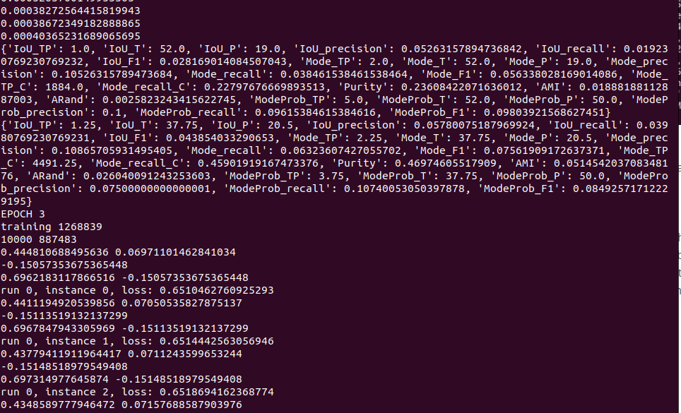

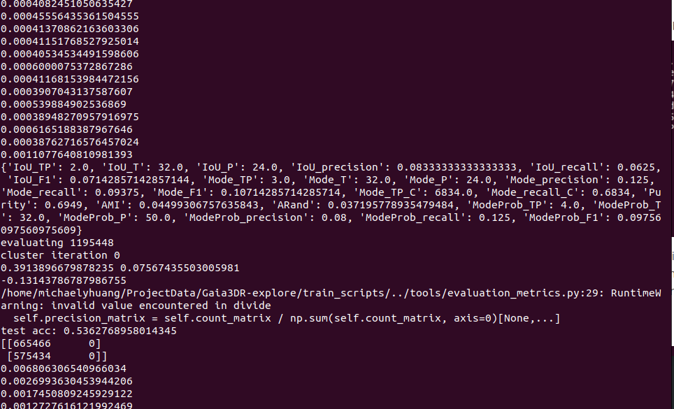

It seems clustering accuracy decreases as we train further, while the egnn loss keeps going down. 

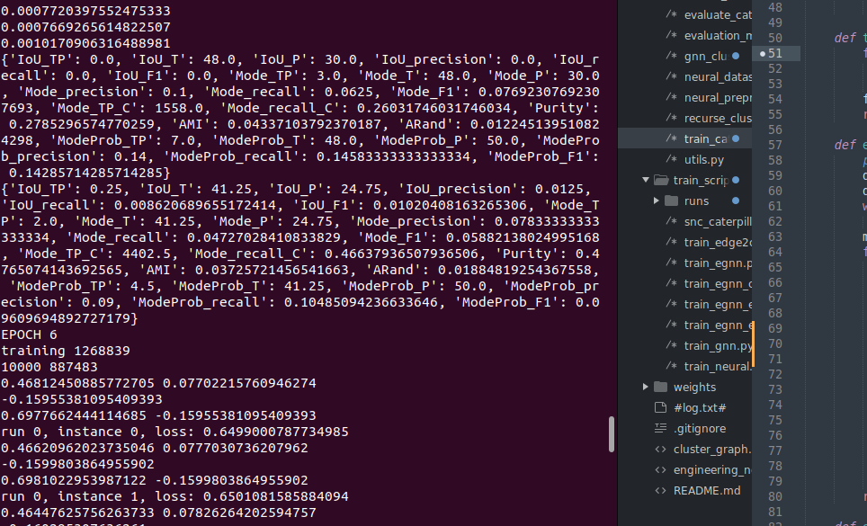

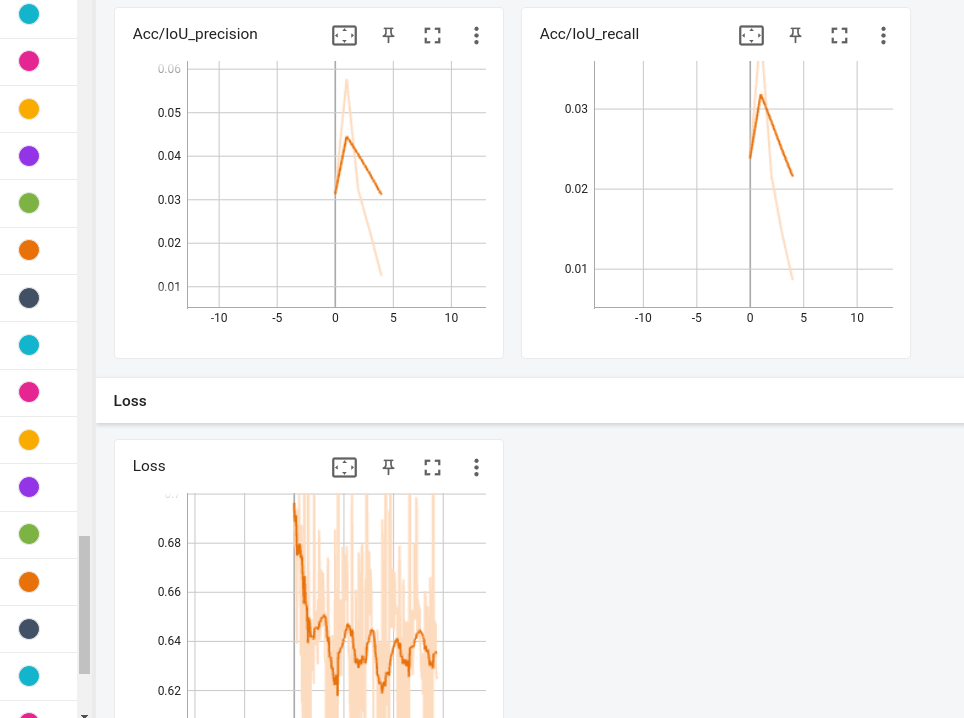

I will investigate why. Possibly it is overfitting to the train dataset? I will print the egnn loss for the validation dataset.

Overfitting is indeed occuring,

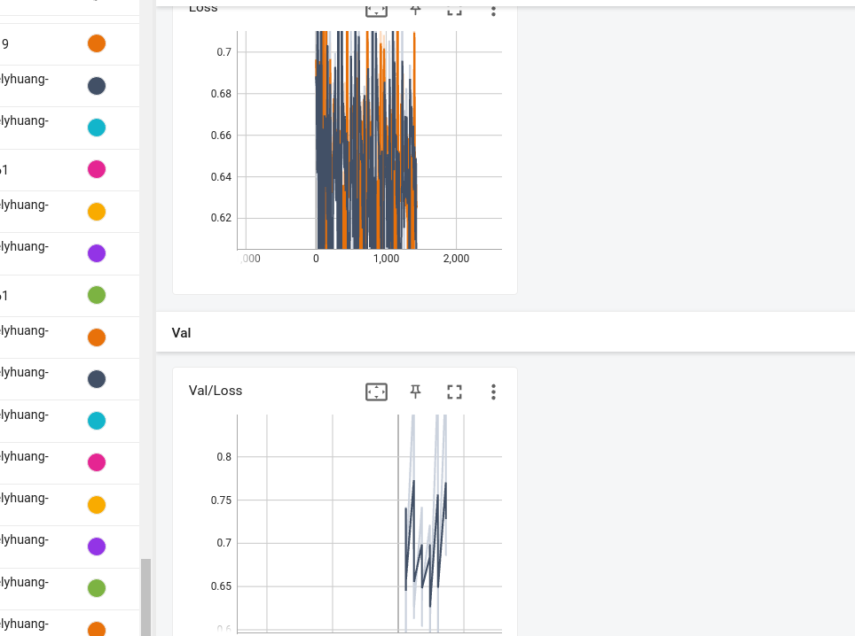

It seems that we eventually learn to enlarge the average predicted probability value (because some are indeed linkages separate). However, on the validation side, we never quite learn that. 

Here's the result with large regularization:

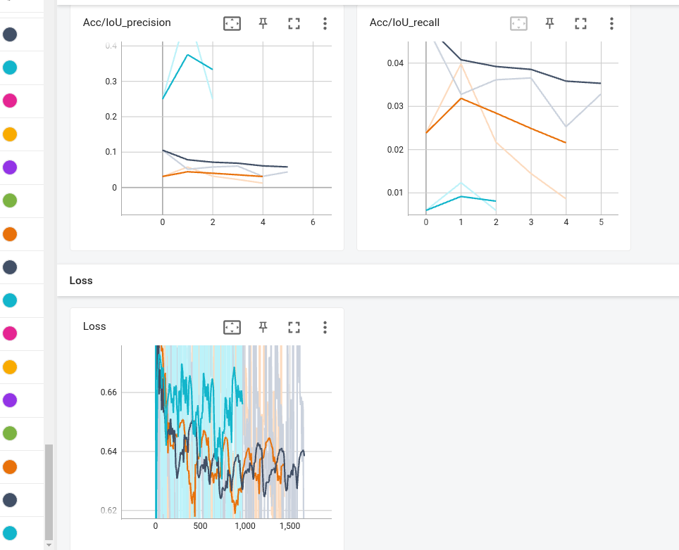

4.

After some considerations, I've determined that some changes need to be made. 

First, new testing has shown that simply increasing the regularizer (that enforces std) is not sufficient to create good clustering results (in fact, it's somehow forcing the clusterer to group all points into a single cluster)

Second, a major shortcoming of the current system is its knn graph being shortsighted. For each evalution (convolution) of the clusterer, we are looking at a small patch of points that are close together. If you have a smooth surface, it is very difficult to determine where to cut the surface so as to separate into clusters! What we need are global viewpoints. The graph convolution with a global viewpoint will function more like an attention mechanism than a normal convolution system. There are many ways to construct global viewpoints-->small sample dense graphs, randomly chosen edges, randomly chosen edges with weighted probability based on distance to the origin point. knn + randomly chosen edges. It's difficult to determine which one would work based on intuitions.

Third, we need to find a way to generate cluster assignments for all points based on few known points or edges. A simple way is to do find the nearest neighbor of each point, and just set it to be the same cluster. A more sophisticated way is to construct a sparse knn graph based on all points. Predict edges for these knn edges and then use the same approach as before. 

5.

I actually have been reading the axis wrong. The top row represents different. Random graph connection is bad. Local view actually isn't much of an issue because of how phase-mixed the clusters are. 

6.

Now I will try the old knn=100 setting, without regularization and using a linear loss. Other losses, which are designed to reward pushing things to extreme, causes everything to be pushed to an extreme from the beginning (the same extreme). We must, unfortunately, conclude that the dataset is simply not containing sufficient info for clear separation of edges. 

7.

We can (potentially) improve the cluster generation step by introducing some spectral component. But the egnn is very limited. So, I've opted to do another clustering algo using projection + kmeans instead. 

This has its own superweird problem: the loss keeps decreasing, but the acc goes down.

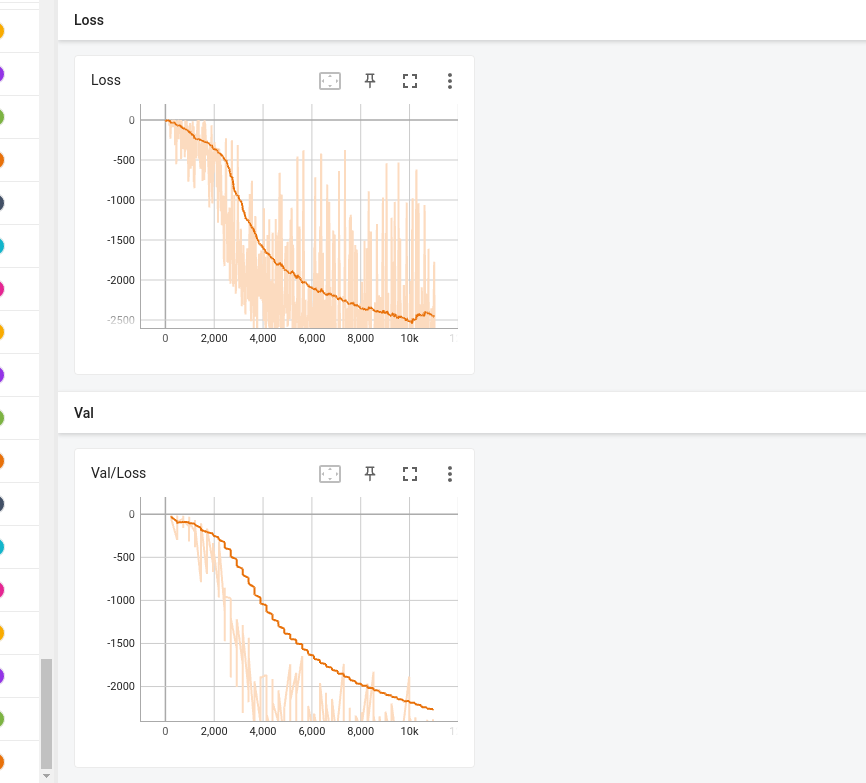

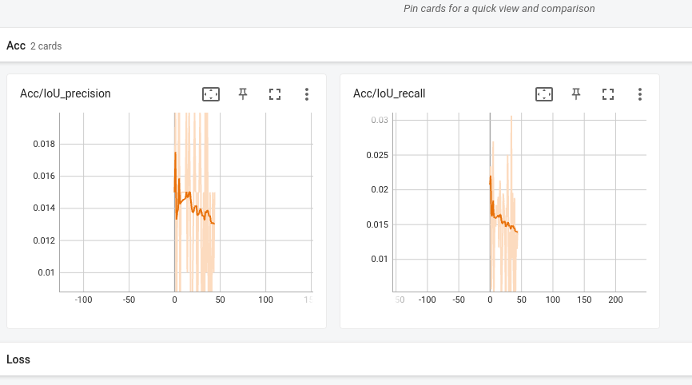

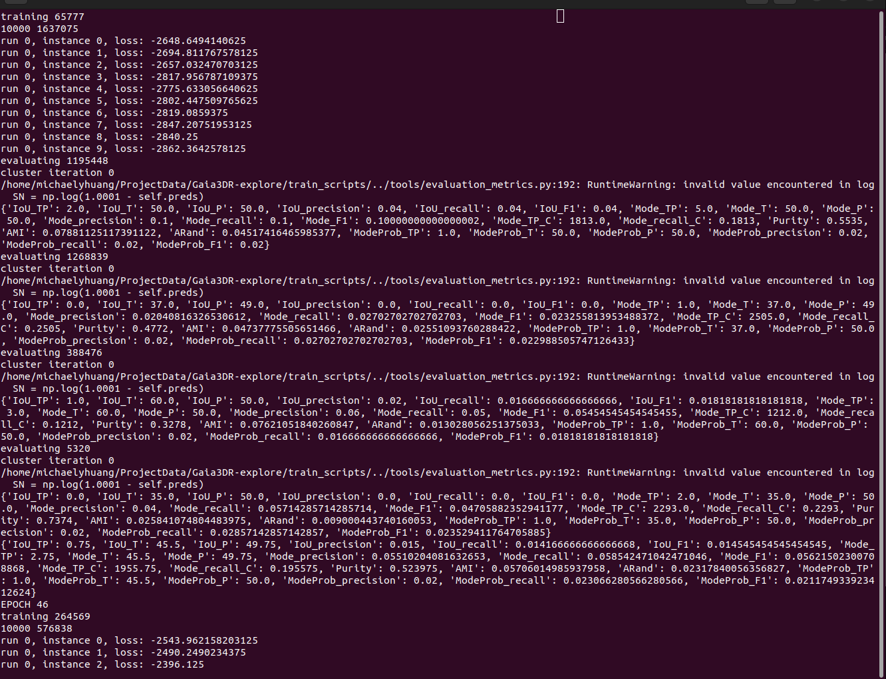

Weird things happen partly because what you entered is not probability prediction. It's probability density.

