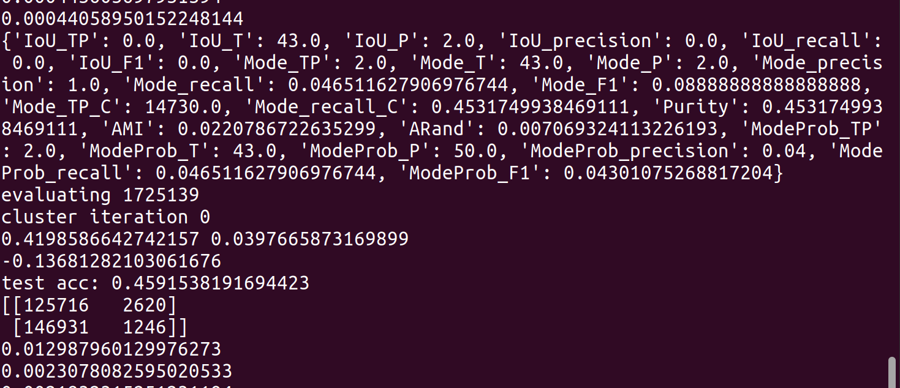

### Oct 18 2022, Tuesday

To recap the current situation: I've just gotten the SNC algorithm to work on caterpillar. I was able to train within a radius of 2 kpc (without filtering small clusters), and using a knn of 100 to construct the clustering graph. The accuracy achieved wasn't the greatest but was bearable. 

My current undertaking is to expand the radius to 5kpc and perform small cluster filtering of stars that are within the said radius. A dataset with those parameters have a cardinality between $10^4$ and $10^5$. That explodes the memory when knn=100. So, I cut knn down to 10, and it works fine. 

The training results, currently, seem pretty bleak. The egnn algorithm is not getting high std (expected) but also very low accuracy of classification. The two rows on the countmatrix are the actual labels (so, we can see that they are fairly even, which is surprising). The columns are the predicted labels. 

It seems to be generating only 1 cluster prediction, which is reasonable since most of the edges are predicted to be connected. Sometimes the first row has 3x as much--> too many connections which makes sense since we reduce knn from 100 to 10. 

The LR is effective, but it is not taking away a lot from each episode of training (we always start from a high loss). 

Matters hardly improve over time. 

